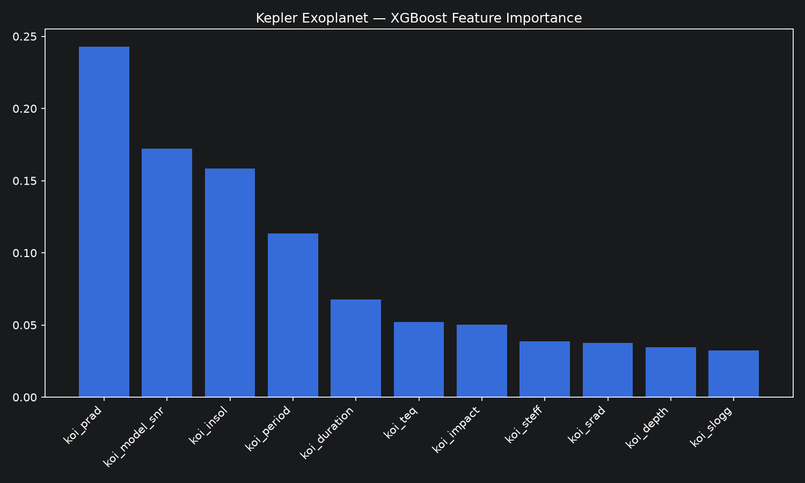

# 🔭 Kepler Exoplanet Classifier

Binary classification of confirmed exoplanets vs false positives
using NASA Kepler mission data.

## 🎯 Results

| Model | Test Accuracy |
|---|---|
| 🏆 XGBoost | 92.6% |
| Random Forest | 91.9% |
| Logistic Regression | 83.5% |

## 📈 Visualizations

### XGBoost Feature Importance

Planet radius (`koi_prad`) and signal-to-noise ratio (`koi_model_snr`)
are the strongest predictors — consistent with established astrophysical
understanding of what distinguishes confirmed planets from false positives.

## 📊 Dataset
- Source: NASA Kepler Object of Interest dataset via Kaggle
- 7,000+ candidate objects
- Binary label: CONFIRMED vs FALSE POSITIVE

## ⚙️ Features
11 stellar and orbital features including planet radius,
signal-to-noise ratio, orbital period, transit duration,
insolation flux, and stellar properties.

## 🔍 Key Finding
Planet radius and signal-to-noise ratio are the strongest
predictors of confirmed exoplanet status, consistent with
established astrophysical understanding.

## 🛠️ Stack
Python, Scikit-learn, XGBoost, NumPy, Pandas, Matplotlib
